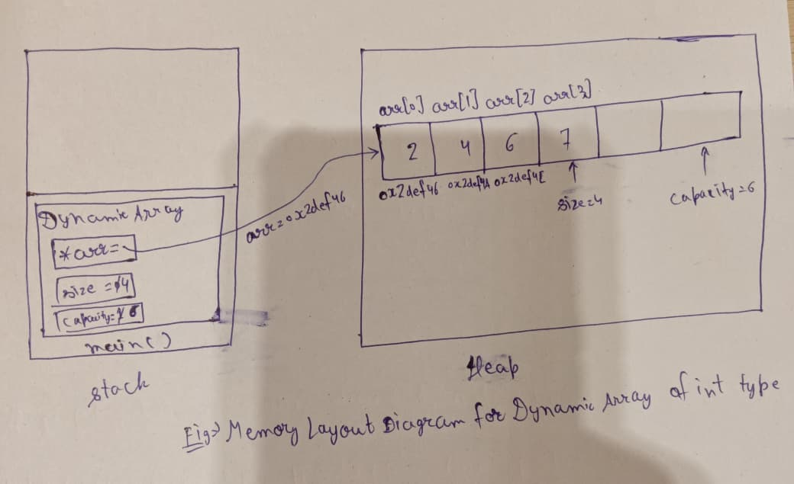

**Project Title:** Building a Data Structures Library and Redis Lite  
**Student Name:** Suman Mondal  
**Date:** 07 July 2026

# Dynamic Array Design Proposal

This proposal describes the design and implementation of the **Dynamic Array** data structure developed as part of the **Data Structures Library**. A Dynamic Array is a growable sequence container that stores elements in contiguous memory and automatically increases its capacity when more space is required.

The proposal is divided into four sections:

1. **Public API**
2. **Internal Representation**
3. **Complexity Estimates**
4. **Design Decisions**

A Dynamic Array behaves like a normal array, but it is not limited to a fixed size. It maintains extra capacity internally so that new elements can be inserted efficiently. When the current capacity becomes full, a larger memory block is allocated, existing elements are moved or copied into it, and the old memory block is released.

The Dynamic Array is implemented as a **class template** using `template<typename T>`. This makes the data structure generic, reusable, and type-independent. The same implementation can store values of different data types such as `int`, `float`, `double`, `std::string`, and user-defined classes.

---

# Section 1: Public API

The **Public API** defines the functions available to the user of the `DynamicArray` class. It describes the function names, parameters, return types, behavior, and important exception conditions.

The purpose of this API is to make the Dynamic Array:

- Simple to use
- Reusable for different data types
- Similar in behavior to modern C++ containers
- Safe against invalid operations
- Easy to maintain and extend

## Class Structure

```cpp
template<typename T>
class DynamicArray {
private:
    T* arr;
    int size;
    int capacity;

public:
    DynamicArray();
    ~DynamicArray();
    DynamicArray(const DynamicArray& other);
    DynamicArray& operator=(const DynamicArray& other);

    void push_back(T ele);
    void pop_back();
    void insertAtIndex(int index, T ele);
    void deleteAtIndex(int index);
    T& get(int index);
    bool isEmpty();
    bool isFull();
    int getSize();
};
```

The function `get()` returns `T&` instead of `T` so that the caller can access the original stored element directly instead of receiving only a copy.

---

## `push_back(T ele)`

The `push_back(T ele)` function inserts a new element at the end of the Dynamic Array.

If sufficient capacity is available, the new element is constructed at index `size`, and then `size` is incremented. If the array is full, the function first allocates a larger memory block, usually with double the current capacity. Existing elements are then moved or copied to the new block, the old memory is released, and the new element is inserted.

### Parameter

- **`T ele`**: The element to be inserted at the end of the array.

### Return Type

- **`void`**: The function does not return a value.

### Exception Conditions

- Throws **`std::bad_alloc`** if memory allocation fails.

---

## `pop_back()`

The `pop_back()` function removes the last element from the Dynamic Array.

If the array is empty, the function throws an exception because there is no element to remove. Otherwise, the destructor of the last stored element is called, and the `size` is decremented. The `capacity` is not reduced during this operation because the same allocated memory may be useful for future insertions.

### Parameter

- **None**

### Return Type

- **`void`**: The function removes the last element and updates the size.

### Exception Conditions

- Throws **`std::underflow_error`** if deletion is attempted on an empty array.

---

## `insertAtIndex(int index, T ele)`

The `insertAtIndex(int index, T ele)` function inserts a new element at the specified index.

First, the function checks whether the index is valid. A valid insertion index lies between `0` and `size`, inclusive. If `index == size`, the element is being inserted at the end, so the function can directly call `push_back(ele)`. This avoids duplicate logic and keeps the implementation cleaner.

If the index is between `0` and `size - 1`, all elements from that index onward are shifted one position to the right. If the array is full, resizing is performed before shifting. After the correct position becomes available, the new element is inserted at the given index, and `size` is incremented.

### Parameters

- **`int index`**: The position where the new element will be inserted.
- **`T ele`**: The element to be inserted.

### Return Type

- **`void`**: The function inserts the element and updates the array.

### Exception Conditions

- Throws **`std::out_of_range`** if `index < 0` or `index > size`.
- Throws **`std::bad_alloc`** if memory allocation fails during resizing.

---

## `deleteAtIndex(int index)`

The `deleteAtIndex(int index)` function removes the element stored at the specified index.

First, the function validates the index. A valid deletion index lies between `0` and `size - 1`. If `index == size - 1`, the element is the last element, so the function can call `pop_back()`. This avoids repeating the same deletion logic.

For all other valid indexes, the element at the given index is destroyed, and all later elements are shifted one position to the left so that the array remains contiguous. Finally, `size` is decremented.

### Parameter

- **`int index`**: The position of the element to be removed.

### Return Type

- **`void`**: The function removes the element and updates the array.

### Exception Conditions

- Throws **`std::out_of_range`** if `index < 0` or `index >= size`.
- Throws **`std::underflow_error`** if deletion is attempted when the array is empty.

---

## `T& get(int index)`

The `get(int index)` function returns the element stored at the specified index.

Because the Dynamic Array stores elements in contiguous memory, the element can be accessed directly using index-based address calculation:

```text
Address = Base Address + (Index * sizeof(T))
```

This allows constant-time random access. Returning a reference (`T&`) avoids unnecessary copying and allows the caller to modify the original element when required.

### Parameter

- **`int index`**: The index of the element to access.

### Return Type

- **`T&`**: A reference to the element stored at the specified index.

### Exception Conditions

- Throws **`std::out_of_range`** if `index < 0` or `index >= size`.

---

## `isEmpty()`

The `isEmpty()` function checks whether the Dynamic Array contains no elements.

It compares `size` with `0`. If `size == 0`, the function returns `true`; otherwise, it returns `false`.

### Parameter

- **None**

### Return Type

- **`bool`**: Returns `true` if the array is empty; otherwise returns `false`.

---

## `isFull()`

The `isFull()` function checks whether the Dynamic Array has reached its current capacity.

It compares `size` with `capacity`. If both values are equal, the array is full and must be resized before inserting another element.

### Parameter

- **None**

### Return Type

- **`bool`**: Returns `true` if the array is full; otherwise returns `false`.

---

## `getSize()`

The `getSize()` function returns the current number of elements stored in the Dynamic Array.

Since the class maintains a separate `size` variable, this function simply returns that value without traversing the array.

### Parameter

- **None**

### Return Type

- **`int`**: The current number of stored elements.

---

# Section 2: Internal Representation

The Dynamic Array internally maintains three essential data members:

1. **Array Pointer (`arr`)**: Stores the base address of the dynamically allocated memory block.
2. **Size (`size`)**: Stores the current number of elements present in the array.
3. **Capacity (`capacity`)**: Stores the maximum number of elements that can currently be stored without resizing.

The pointer `arr` is of type `T*`, where `T` represents the type of elements stored in the array. Both `size` and `capacity` are integers.

Assuming a **64-bit system**, an `int` usually occupies **4 bytes**, and a pointer usually occupies **8 bytes**. Therefore, the memory required by the object's data members is:

```text
size      : 4 bytes
capacity  : 4 bytes
arr       : 8 bytes
----------------------
Total     : 16 bytes
```

This calculation represents only the size of the Dynamic Array object's own data members. The actual elements are stored separately in a dynamically allocated memory block on the heap.

## Memory Layout

The memory layout diagram of the Dynamic Array object shows that the object itself stores `arr`, `size`, and `capacity`, while the actual elements are stored in a dynamically allocated contiguous memory block on the heap. The array pointer `arr` stores the base address of this memory block.




## Template Concept and Generic Type

The Dynamic Array is implemented using `template<typename T>`. In this declaration, `T` is a placeholder for the actual data type that will be used when an object is created.

For example:

```cpp
DynamicArray<int> marks;
DynamicArray<double> prices;
DynamicArray<std::string> names;
```

Here, the same class implementation is reused for different data types. This is called **generic programming**. Templates are useful because they avoid writing separate classes such as `IntArray`, `FloatArray`, and `StringArray`.

Using a generic type also improves maintainability. If the insertion logic, deletion logic, or resizing strategy changes, it only needs to be changed once in the template class.

## Object-Oriented Programming Principles Used

The implementation uses the following OOP principles:

- **Encapsulation:** The data members `arr`, `size`, and `capacity` are kept private. Users access the array only through public member functions.
- **Abstraction:** The user can call functions such as `push_back()`, `insertAtIndex()`, and `get()` without knowing the internal resizing and shifting logic.
- **Modularity:** Each operation is implemented as a separate member function with a clear responsibility.
- **Code Reuse:** Functions such as `insertAtIndex()` can call `push_back()` when insertion occurs at the end, and `deleteAtIndex()` can call `pop_back()` when deleting the last element.

Inheritance and polymorphism are not required for this data structure because the main goal is efficient storage and management of a sequence of elements.

## Rule of Three

Since the Dynamic Array manages dynamically allocated memory, it follows the **Rule of Three**:

1. **Destructor**
2. **Copy Constructor**
3. **Copy Assignment Operator**

### Destructor

The destructor destroys all constructed elements and releases the dynamically allocated memory block. This prevents memory leaks.

### Copy Constructor

The copy constructor creates a new Dynamic Array as a copy of an existing one. It performs a **deep copy**, which means it allocates a separate memory block and copies each element into it.

### Copy Assignment Operator

The copy assignment operator copies one existing Dynamic Array into another existing object. It releases the old memory safely, handles self-assignment, allocates new memory, and copies the elements. This prevents shallow copying, double deletion, dangling pointers, and memory leaks.

---

# Section 3: Complexity Estimates

The following table summarizes the time complexity of each public function.

| Function | Best Case | Average Case | Worst Case | Reason |
|---|---:|---:|---:|---|
| `push_back(T ele)` | `O(1)` | `O(1)` amortized | `O(n)` | Direct insertion is constant time, but resizing requires copying or moving all elements. |
| `pop_back()` | `O(1)` | `O(1)` | `O(1)` | Only the last element is destroyed and `size` is decremented. |
| `insertAtIndex(int index, T ele)` | `O(1)` | `O(n)` | `O(n)` | Insertion at the end may call `push_back()`, while middle or front insertion requires shifting elements. |
| `deleteAtIndex(int index)` | `O(1)` | `O(n)` | `O(n)` | Deleting the last element may call `pop_back()`, while other deletions require left shifting. |
| `get(int index)` | `O(1)` | `O(1)` | `O(1)` | Address calculation allows direct access. |
| `isEmpty()` | `O(1)` | `O(1)` | `O(1)` | Only compares `size` with `0`. |
| `isFull()` | `O(1)` | `O(1)` | `O(1)` | Only compares `size` with `capacity`. |
| `getSize()` | `O(1)` | `O(1)` | `O(1)` | Directly returns the stored size value. |

## Complexity Analysis

The Dynamic Array provides **constant-time random access** because all elements are stored in contiguous memory locations. Operations at the end, such as `push_back()` and `pop_back()`, are very efficient because they usually do not require shifting elements.

Insertion and deletion at arbitrary indexes are slower because elements must be shifted to preserve contiguous storage. Therefore, these operations take `O(n)` time in the average and worst cases.

The resizing strategy introduces an occasional `O(n)` cost when the array becomes full. However, if the capacity is doubled each time, resizing does not happen on every insertion. Over many insertions, the total cost is spread out, so `push_back()` has **O(1) amortized time complexity**.

For example, during repeated insertions, capacities grow as:

```text
1, 2, 4, 8, 16, 32, ...
```

The number of resizing operations needed to store `n` elements is approximately:

```text
O(log n)
```

The total number of copied elements over all resizing operations forms a geometric series:

```text
1 + 2 + 4 + 8 + ... + n/2 = O(n)
```

Therefore, the total work for `n` insertions is `O(n)`, making the average cost per insertion `O(1)`.

---

# Section 4: Design Decisions

## Initial Size and Capacity

The `size` is initialized to `0` because the Dynamic Array initially contains no elements. The `capacity` is initialized to `1` instead of `0`.

If `capacity` were initialized to `0`, doubling it would still produce `0`, and the array would not be able to allocate space for the first element. Starting with capacity `1` gives the array a valid initial memory block.

## Contiguous Memory Allocation

The Dynamic Array stores all elements in one contiguous memory block. This allows direct access using indexes and improves cache performance because nearby elements are stored close to each other in memory.

## Dynamic Resizing

When the array becomes full, a larger memory block is allocated. The existing elements are copied or moved into the new block, and the old block is released. This allows the array to grow according to program requirements instead of having a fixed size.

## Capacity Growth Strategy

The capacity is doubled when the array becomes full. Doubling provides a practical balance between performance and memory usage.

If the capacity increased by only one element each time, every insertion after the array became full would require reallocation, making repeated insertion inefficient. If the capacity increased by a very large factor, resizing would be rare, but too much memory could remain unused.

Therefore, doubling is commonly used because it keeps insertion efficient while avoiding excessive unused memory.

## Why Shrinking Is Not Used

Shrinking means reducing the capacity of the Dynamic Array when many elements have been removed. For example, if the capacity is `64` but only `10` elements are stored, some memory is unused.

In this implementation, shrinking is **not used** in `pop_back()` or `deleteAtIndex()`. During deletion, only the `size` is reduced, while the `capacity` remains unchanged. This is intentional because Dynamic Arrays keep extra capacity to make future insertions faster.

Shrinking is not mandatory for a Dynamic Array. If the capacity is reduced after every deletion, repeated insertion and deletion near the same size can cause frequent memory reallocation. This would make the array slower because elements may need to be copied or moved again and again.

For this reason, the implementation avoids shrinking during deletion and focuses on efficient insertion, deletion, and indexed access. A shrinking strategy can be added later if memory optimization becomes important. In that case, shrinking should be controlled, for example only when:

```text
size <= capacity / 4
```

Then the capacity can be reduced to half. This avoids wasting too much memory while still preventing unnecessary resize operations.

## Generic Programming Using Templates

Templates allow the Dynamic Array to work with many data types using a single implementation. This improves code reuse and keeps the design flexible.

The type `T` is resolved at compile time, so the compiler generates type-specific code for each used type. This means the class remains generic while still maintaining type safety.

## Manual Memory Management

The implementation uses dynamic memory allocation to control the internal storage manually. If raw memory is allocated using `malloc()`, placement `new` should be used to construct objects of type `T`, and destructors should be called explicitly before releasing memory using `free()`.

This is important because `malloc()` only allocates memory; it does not call constructors. Similarly, `free()` only releases memory; it does not call destructors.

## Exception Handling

The implementation checks boundary conditions before performing operations. Invalid access or modification attempts should throw meaningful exceptions:

- **`std::out_of_range`** for invalid indexes
- **`std::underflow_error`** for deletion from an empty array
- **`std::bad_alloc`** for memory allocation failure

Using exceptions prevents undefined behavior and makes the data structure safer and easier to debug.

## Function Reuse

Some functions reuse other functions to avoid duplicate code. For example:

- `insertAtIndex(size, ele)` calls `push_back(ele)`.
- `deleteAtIndex(size - 1)` calls `pop_back()`.

This improves maintainability because the logic for inserting at the end and deleting from the end is written in only one place.

## Trade-offs

Compared with a linked list, a Dynamic Array provides faster indexed access because it stores elements contiguously. However, insertion and deletion in the middle can be slower because elements must be shifted.

The Dynamic Array is best suited for situations where random access and insertion at the end are frequent. It is less suitable when frequent insertion and deletion are required at the beginning or middle of the sequence.

---