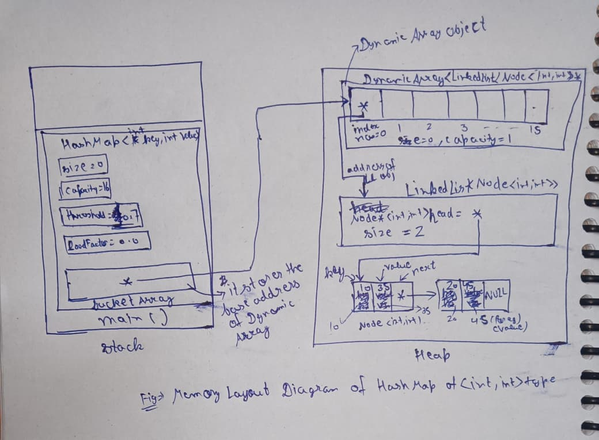

**Project Title:** Building a Data Structures Library and Redis Lite  
**Student Name:** Suman Mondal  
**Date:** 08 July 2026

# HashMap Design Proposal

This proposal describes the design and implementation of the **HashMap** data structure developed as part of the **Data Structures Library**. It explains the public interface, internal representation, complexity estimates, and the major design decisions considered during implementation.

The proposal is divided into four sections:

1. **Public API**
2. **Internal Representation**
3. **Complexity Estimates**
4. **Design Decisions**

A **HashMap** is a hash-based associative data structure that stores data in the form of **key-value pairs**. Each value is associated with a unique key, allowing data to be inserted, searched, updated, and removed efficiently without performing sequential traversal. Instead of searching through every stored element, the HashMap computes the storage location directly from the key, making it one of the most efficient data structures for key-based lookup.

The working of a HashMap is based on **hashing**. Whenever a key is inserted or searched, a **hash function** converts the key into an integer called the **hash value**. Since the hash value may be larger than the available storage, it is transformed into a valid bucket index using the modulo operation.

```cpp
bucketIndex = hashValue % capacity;
```

The computed bucket index identifies the location in the bucket array where the corresponding key-value pair should be stored or searched. If multiple keys produce the same bucket index, a situation known as a **collision** occurs. In this implementation, collisions are resolved using **Separate Chaining**, where each bucket stores a linked list of entries. Multiple key-value pairs that map to the same bucket are linked together, allowing all colliding elements to be stored without overwriting existing data.

The HashMap is implemented as a **class template** using `template<typename K, typename V>`. This enables the same implementation to work with different combinations of key and value types, including primitive data types, `std::string`, and user-defined classes. Different hashing strategies are selected automatically based on the type of the key to ensure correct and efficient hash value generation.

Internally, the HashMap uses two previously implemented data structures:

- A **DynamicArray** to maintain the bucket array.
- A **LinkedList** in each bucket to store colliding entries.

By combining these two data structures with an efficient hashing mechanism, the HashMap provides average-case **O(1)** insertion, lookup, and deletion while dynamically growing through **rehashing** whenever the load factor exceeds a predefined threshold.

## Class Structure

```cpp
template<typename K, typename V>
class Node {
public:
    K key;
    V value;

    Node();
    Node(K key, V value);
};

template<typename K, typename V>
class HashMap {
private:
    DynamicArray<LinkedList<Node<K, V>>*> bucketArray;
    int size;
    int capacity;
    float loadFactor;
    float threshold;

    int generateHashValue(K key);
    int generateBucketIndex(K key);
    void rehash();

public:
    HashMap();
    ~HashMap();
    HashMap(const HashMap& other);
    HashMap& operator=(const HashMap& other);

    void insert(K key, V value);
    void remove(K key);
    V& get(K key);
    bool exists(K key);
    int getSize();
    float getLoadFactor();
    void clear();
};
```

---

# Section 1: Public API

## `void insert(K& key, V& value)`

The `insert(K& key, V& value)` function inserts a new **key-value pair** into the HashMap. If the specified key does not already exist, a new entry is created and stored in the appropriate bucket. If the key already exists, the associated value is updated instead of creating a duplicate entry.

The insertion process begins by generating a **hash value** for the given key using the `HashFunction`, which is explained in **Section 2: Internal Representation**.

Once the hash value is generated, the corresponding **bucket index** is calculated using the modulo operation with the current capacity of the bucket array.

```cpp
bucketIndex = hashValue % capacity;
```

The bucket array is implemented using a `DynamicArray`, where each element stores a pointer to a `LinkedList<Node<K, V>>`. If no linked list exists at the computed bucket index, a new linked list is created.

The linked list corresponding to the bucket is then searched to determine whether the key already exists. If the key is found, its associated value is updated. Otherwise, a new `Node<K, V>` object is inserted at the **front** of the linked list using `push_front()`. Inserting at the front avoids traversing the entire linked list and keeps the insertion operation efficient.

If multiple keys produce the same bucket index, a **collision** occurs. This implementation resolves collisions using **Separate Chaining**, where all colliding entries are stored in the linked list associated with that bucket.

After a successful insertion, the total number of stored key-value pairs is incremented and the **load factor** is recalculated.

```cpp
loadFactor = (float)(size / capacity);
```

If the load factor exceeds the predefined threshold, the HashMap performs **rehashing**, where a larger bucket array is allocated and all existing entries are redistributed according to the new capacity. This helps maintain efficient average-case performance by reducing the number of collisions.

### Parameters

- **`K& key`**: The key used to uniquely identify the value.
- **`V& value`**: The value associated with the specified key.

### Return Type

- **`void`**: The function inserts a new key-value pair or updates the value of an existing key.

### Exception Conditions

- Throws **`std::bad_alloc`** if memory allocation fails while creating a new bucket or entry.

### Time Complexity

- **Best Case:** `O(1)`
- **Average Case:** `O(1)`
- **Worst Case:** `O(n)`

---
## `void remove(K key)`

The `remove(K key)` function removes the key-value pair associated with the specified key from the HashMap.

The removal process begins by generating the **hash value** of the given key using the hash function. The generated hash value is then converted into a valid **bucket index** using the modulo operation.

```cpp
bucketIndex = hashValue % capacity;
```

Using the bucket index, the corresponding bucket is accessed from the bucket array. If the bucket is empty, it indicates that the specified key is not present in the HashMap, and the function throws an exception.

If the bucket contains a linked list, the function traverses the linked list sequentially and compares the key stored in each node with the given key. If a matching key is found, the corresponding node is removed from the linked list, the allocated memory is released, and the current size of the HashMap is decremented.

After the deletion is completed, the load factor is recalculated to reflect the current state of the HashMap.

If the entire linked list is traversed without finding the specified key, the function throws an exception indicating that the key does not exist in the HashMap.

### Parameter

- **`K key`**: The key whose corresponding key-value pair is to be removed.

### Return Type

- **`void`**: The function removes the specified key-value pair from the HashMap and does not return any value.

### Exception Conditions

- Throws **`std::runtime_error`** if the specified key is not found.

### Time Complexity

- **Best Case:** `O(1)`
- **Average Case:** `O(1)`
- **Worst Case:** `O(n)`

---
## `V& get(K key)`

The `get(K key)` function returns the value associated with the specified key from the HashMap.

The retrieval process begins by generating the **hash value** of the given key using the hash function. The generated hash value is then converted into a valid **bucket index** using the modulo operation.

```cpp
bucketIndex = hashValue % capacity;
```

Using the bucket index, the corresponding bucket is accessed from the bucket array. If the bucket is empty, it indicates that the specified key is not present in the HashMap, and the function throws an exception.

If the bucket contains a linked list, the function traverses the linked list sequentially and compares the key stored in each node with the given key. If a matching key is found, the function returns a **reference (`V&`)** to the corresponding value stored in that node.

Returning a reference avoids creating an unnecessary copy of the stored value and allows the caller to directly access or modify the original value stored inside the HashMap.

If the entire linked list is traversed without finding the specified key, the function throws an exception indicating that the key does not exist in the HashMap.

### Parameter

- **`K key`**: The key whose corresponding value is to be retrieved.

### Return Type

- **`V&`**: A reference to the value associated with the specified key.

### Exception Conditions

- Throws **`std::runtime_error`** if the specified key is not found.

### Time Complexity

- **Best Case:** `O(1)`
- **Average Case:** `O(1)`
- **Worst Case:** `O(n)`

---
## `bool exists(K key)`

The `exists(K key)` function checks whether the specified key is present in the HashMap.

The search process begins by generating the **hash value** of the given key using the hash function. The generated hash value is then converted into a valid **bucket index** using the modulo operation.

```cpp
bucketIndex = hashValue % capacity;
```

Using the bucket index, the corresponding bucket is accessed from the bucket array. If the bucket is empty, the function immediately returns `false`, indicating that the specified key is not present in the HashMap.

If the bucket contains a linked list, the function traverses the linked list sequentially and compares the key stored in each node with the given key. If a matching key is found, the function returns `true`.

If the entire linked list is traversed without finding the specified key, the function returns `false`.

Unlike the `get()` function, this function only checks for the presence of the key and does not return the associated value. It also does not throw an exception when the key is absent, making it suitable for checking whether a key exists before performing operations such as insertion, retrieval, or deletion.

### Parameter

- **`K key`**: The key whose existence is to be checked.

### Return Type

- **`bool`**: Returns `true` if the specified key exists in the HashMap; otherwise, returns `false`.

### Exception Conditions

- May propagate exceptions generated during key comparison.

### Time Complexity

- **Best Case:** `O(1)`
- **Average Case:** `O(1)`
- **Worst Case:** `O(n)`

---
## `int getSize()`

The `getSize()` function returns the current number of key-value pairs stored in the HashMap.

The HashMap maintains a separate integer variable named `size`, which is updated after every successful insertion and deletion. Since the current size is already maintained, the function simply returns the value of this variable without traversing any bucket or linked list.

### Parameter

- **None**

### Return Type

- **`int`**: The current number of key-value pairs stored in the HashMap.

### Time Complexity

- **Best Case:** `O(1)`
- **Average Case:** `O(1)`
- **Worst Case:** `O(1)`

---

## `float getLoadFactor()`

The `getLoadFactor()` function returns the current load factor of the HashMap.

The load factor represents how full the HashMap is and is calculated as the ratio of the total number of stored key-value pairs to the total number of buckets.

```cpp
loadFactor = (float)size / capacity;
```

The HashMap maintains the value of the load factor by updating it after every successful insertion, deletion, and rehashing operation. Therefore, this function simply returns the current value of the `loadFactor` variable without performing any additional computation.

The returned value can be used to determine whether the HashMap is approaching its predefined threshold and whether rehashing may be required after subsequent insertions.

### Parameter

- **None**

### Return Type

- **`float`**: The current load factor of the HashMap.

### Time Complexity

- **Best Case:** `O(1)`
- **Average Case:** `O(1)`
- **Worst Case:** `O(1)`

## `void clear()`

The `clear()` function removes all key-value pairs stored in the HashMap and restores it to an empty state.

The function traverses the entire bucket array. For each bucket, it checks whether a linked list is present. If the bucket contains a linked list, all nodes stored in that linked list are deleted, the memory occupied by the linked list is released, and the corresponding bucket pointer is set to `nullptr`.

After all buckets have been processed, the `size` of the HashMap is reset to `0`, and the `loadFactor` is updated to `0.0`. The bucket array and its capacity remain unchanged, allowing the HashMap to be reused without allocating a new bucket array.

This function is useful when all stored data needs to be removed while preserving the existing bucket structure for future insertions.

### Parameter

- **None**

### Return Type

- **`void`**: The function removes all key-value pairs from the HashMap and does not return any value.

### Time Complexity

- **Best Case:** `O(capacity)`
- **Average Case:** `O(capacity + n)`
- **Worst Case:** `O(capacity + n)`


# Section 2: Internal Representation

The **Internal Representation** section explains how the HashMap is organized internally and how its components work together to store and retrieve key-value pairs efficiently.

The HashMap is built using the two data structures developed previously:

- **DynamicArray** – Stores the buckets of the HashMap.
- **LinkedList** – Stores all key-value pairs that belong to the same bucket.
- **Node<K, V>** – Represents an individual key-value pair.

The bucket array is implemented as:

```cpp
DynamicArray<LinkedList<Node<K, V>>*> bucketArray;
```

Each element of the dynamic array stores a **pointer to a linked list** instead of a linked list object. Initially, every bucket contains `nullptr`. A linked list is allocated only when the first key-value pair is inserted into that bucket. This avoids creating unnecessary linked list objects for empty buckets and improves memory utilization.

Whenever a key-value pair is inserted, the HashMap first generates a **hash value** from the key using the `HashFunction` class. The generated hash value is then converted into a valid bucket index using the modulo operation.

```cpp
bucketIndex = hashValue % capacity;
```

The bucket index determines the position where the key-value pair should be stored. If the corresponding bucket is empty, a new linked list is created and the node is inserted. If another key maps to the same bucket index, the node is inserted into the existing linked list. This collision handling technique is known as **Separate Chaining**.

The HashMap maintains the following private data members:

- **`DynamicArray<LinkedList<Node<K, V>>*> bucketArray`** – Stores pointers to the buckets.
- **`int size`** – Stores the current number of key-value pairs.
- **`int capacity`** – Stores the total number of buckets.
- **`float loadFactor`** – Stores the current load factor.
- **`float threshold`** – Stores the maximum permissible load factor before rehashing.

The load factor is calculated as:

```cpp
loadFactor = (float)size / capacity;
```

When the load factor exceeds the predefined threshold, the HashMap performs **rehashing**. A new bucket array with a larger capacity is created, and every existing key-value pair is inserted into the new bucket array after recalculating its bucket index. Rehashing redistributes the elements across more buckets, reducing collisions and maintaining efficient performance.

## Memory Layout



## Template Concept and Generic Types

The HashMap is implemented using a class template.

```cpp
template<typename K, typename V>
class HashMap;
```

Here, `K` represents the data type of the key, while `V` represents the data type of the corresponding value.

Using templates allows a single implementation of the HashMap to store different combinations of key and value types while maintaining compile-time type safety.

For example,

```cpp
HashMap<int, std::string> students;
HashMap<std::string, int> marks;
```

## Hash Function

The hash function mechanism is still under development and is being designed incrementally as the HashMap implementation evolves.

At the current stage, the **HashFunction** class provides overloaded functions for handling all common primitive data types such as `int`, `char`, `bool`, `short`, `long`, `float`, `double`, and `std::string`. Each overload generates a hash value appropriate for that data type. Numeric data types use their numeric values directly as the basis for hash generation, while strings are hashed using the **Polynomial Rolling Hash** algorithm.

The **Polynomial Rolling Hash** algorithm computes the hash value of a string by treating it as a polynomial. Each character contributes to the final hash according to its position in the string. A fixed prime number (commonly **31**) is used as the multiplication base, causing each successive character to have a greater influence on the final hash value. This approach produces a good distribution of hash values, minimizes collisions for typical text data, and can be computed efficiently in linear time.

Handling **user-defined classes** is more challenging because the HashMap cannot automatically determine which data member uniquely represents the object and should be used as the key. Different applications may consider different members to be the logical identifier of the same class.

Therefore, the current design requires the user to explicitly specify how the hash value should be generated for their custom type. This can be done in one of the following ways:

* Specify which data member should be treated as the key for hash generation. The HashMap will then generate the hash value based on that selected member.
* Provide a member function that computes and returns the hash value for the object. In this case, the HashMap directly uses the user-provided hash value.

This design ensures that the hash value is generated from the logical identity of the object rather than making assumptions about its internal representation. It also allows different applications to choose the most appropriate key for the same user-defined class.

Since this project is being developed iteratively, this represents the current design decision rather than the final solution. As the implementation progresses, more generic and automated approaches for supporting user-defined data types will be researched, evaluated, and incorporated into the HashMap implementation.


## Object-Oriented Programming Principles Used

The implementation applies the following object-oriented programming principles:

- **Encapsulation:** Internal data members are private and are accessed only through public member functions.
- **Abstraction:** Users interact with operations such as `insert()`, `remove()`, `get()`, and `exists()` without knowing the internal hashing mechanism.
- **Modularity:** Responsibilities are divided among the `HashMap`, `HashFunction`, `DynamicArray`, and `LinkedList` classes.
- **Code Reuse:** The previously implemented `DynamicArray` and `LinkedList` are reused to build the HashMap.

Inheritance and polymorphism are not required because the implementation does not involve runtime behavior specialization.

## Rule of Three

Since the HashMap manages dynamically allocated memory, it follows the **Rule of Three**.

### Destructor

The destructor deletes every linked list allocated inside the bucket array. Since each linked list destroys its own nodes, all key-value pairs are automatically deallocated.

### Copy Constructor

The copy constructor performs a **deep copy** by creating a new bucket array and copying every key-value pair into newly allocated linked lists.

### Copy Assignment Operator

The copy assignment operator first releases the memory owned by the destination object and then performs a deep copy of the source object. It also handles self-assignment safely, preventing memory leaks and double deletion.

---

# Section 3: Complexity Estimates

The following table summarizes the time complexity of each public member function of the `HashMap`. The analysis assumes the use of **separate chaining** for collision resolution and a **load factor threshold of 0.7**, which helps maintain efficient average-case performance by triggering rehashing before the table becomes excessively full.

| Function          |   Best Case   |    Average Case   |     Worst Case    | Reason                                                                                                                                                                                                                                                                                                                                                                     |
| ----------------- | :-----------: | :---------------: | :---------------: | -------------------------------------------------------------------------------------------------------------------------------------------------------------------------------------------------------------------------------------------------------------------------------------------------------------------------------------------------------------------------- |
| `insert()`        |     `O(1)`    |       `O(1)`      |       `O(n)`      | The hash function computes the bucket index in constant time. In the average case, insertion occurs directly into the corresponding bucket. In the worst case, if many keys collide into the same bucket, the linked list must be traversed to check for duplicate keys before insertion. During a resize operation, rehashing all existing elements requires `O(n)` time. |
| `remove()`        |     `O(1)`    |       `O(1)`      |       `O(n)`      | The target bucket is located in constant time. If collisions exist, the corresponding linked list must be searched sequentially until the required key is found and removed.                                                                                                                                                                                               |
| `get()`           |     `O(1)`    |       `O(1)`      |       `O(n)`      | Bucket access is constant time. Retrieval requires traversing only the linked list within the selected bucket. If all elements reside in a single bucket, the entire chain may need to be searched.                                                                                                                                                                        |
| `exists()`        |     `O(1)`    |       `O(1)`      |       `O(n)`      | Performs the same search process as `get()`, but returns only whether the key is present.                                                                                                                                                                                                                                                                                  |
| `getSize()`       |     `O(1)`    |       `O(1)`      |       `O(1)`      | Returns the maintained `size` data member without traversing any data structure.                                                                                                                                                                                                                                                                                           |
| `getLoadFactor()` |     `O(1)`    |       `O(1)`      |       `O(1)`      | Computes or returns the maintained load factor directly using stored member variables.                                                                                                                                                                                                                                                                                     |
| `clear()`         | `O(capacity)` | `O(capacity + n)` | `O(capacity + n)` | Iterates through every bucket and deletes every node stored in the linked lists. Empty buckets are also visited, making the complexity dependent on both the number of buckets and the number of stored elements.                                                                                                                                                          |

## Complexity Analysis

The HashMap is designed to provide **constant-time average performance** for insertion, deletion, retrieval, and key existence checking. This efficiency is achieved by distributing keys across multiple buckets using a hash function and resolving collisions through **separate chaining**. As long as the hash function distributes keys uniformly and the load factor remains below the predefined threshold, each bucket contains only a small number of elements, allowing most operations to complete in constant time.

The **worst-case time complexity** for `insert()`, `remove()`, `get()`, and `exists()` is **O(n)**. This occurs when a poor hash function or an adversarial input causes every key to be mapped to the same bucket. In such a scenario, the HashMap effectively degenerates into a singly linked list, requiring sequential traversal of up to `n` elements for each operation.

The `insert()` operation may also occasionally perform a **rehashing** step when the load factor exceeds the threshold (0.7). Rehashing allocates a larger bucket array and reinserts every existing key-value pair into the new table, resulting in an `O(n)` operation. However, because rehashing occurs infrequently, the amortized time complexity of insertion remains **O(1)**.

The `getSize()` and `getLoadFactor()` member functions execute in **constant time** because both values are maintained as data members of the HashMap and do not require traversal of either the bucket array or the linked lists.

The `clear()` function removes every stored key-value pair by traversing all buckets and deleting each node from the corresponding linked lists. Consequently, its running time depends on both the **number of buckets (`capacity`)** and the **number of stored elements (`n`)**, resulting in an overall complexity of **O(capacity + n)**.


# Section 4: Design Decisions

The implementation of the HashMap involved evaluating multiple design alternatives before selecting the final architecture. The objective was to develop a generic, reusable, efficient, and maintainable associative container while keeping the implementation modular and easy to extend. The following sections describe the major design decisions taken during the development process along with the alternatives that were considered and the rationale behind each choice.

---

## 1. Generic Implementation Using Templates

### Selected Design

The HashMap is implemented as a class template.

```cpp
template<typename K, typename V>
class HashMap;
```

### Alternative Considered

Creating separate implementations for different key and value types.

### Reason for Rejection

Maintaining separate implementations would introduce unnecessary code duplication and make future maintenance significantly more difficult.

### Reason for Selection

Templates enable the same implementation to work with any valid key and value type while preserving compile-time type safety and improving code reusability.

---

## 2. Representing Each Entry Using a Separate Node

### Selected Design

Each key-value pair is stored inside a dedicated `Node<K, V>` object.

### Alternative Considered

Maintaining separate storage structures for keys and values.

### Reason for Rejection

Keeping keys and values in separate containers complicates insertion, deletion, and lookup operations while increasing synchronization overhead.

### Reason for Selection

Storing the key and its associated value together allows every node to represent one complete mapping, making bucket operations straightforward and easier to maintain.

---

## 3. Dynamic Array for Bucket Storage

### Selected Design

The bucket table is implemented using the previously developed `DynamicArray`.

```cpp
DynamicArray<LinkedList<Node<K,V>>*> bucketArray;
```

Each element of the dynamic array stores the **address of a `LinkedList` object** rather than storing the linked list object itself. When a bucket is required, a `LinkedList` object is dynamically allocated, and its address is stored in the corresponding bucket.

### Alternative Considered

* Using a fixed-size array.
* Storing `LinkedList<Node<K,V>>` objects directly inside the bucket array.

### Reason for Rejection

A fixed-size array cannot expand when rehashing becomes necessary, limiting the scalability of the HashMap.

Storing `LinkedList` objects directly inside the bucket array would require constructing a linked list object for every bucket, regardless of whether that bucket ever stores any key-value pairs. This increases the memory footprint of the HashMap, especially when the load factor is low and many buckets remain unused.

### Reason for Selection

Using the custom `DynamicArray` allows the bucket table to resize dynamically during rehashing, enabling the HashMap to grow as more elements are inserted.

Additionally, storing **pointers to linked list objects** instead of the objects themselves reduces unnecessary object construction. A linked list is created only when a bucket is actually used, while the bucket array stores only the memory address of that linked list. This approach keeps the bucket array lightweight and avoids allocating complete linked list objects for buckets that never receive any elements.

---

## 4. Separate Chaining for Collision Resolution

### Selected Design

Collisions are resolved using **Separate Chaining**, where each bucket maintains a singly linked list of key-value pairs.

### Alternative Considered

* Linear Probing
* Quadratic Probing
* Double Hashing

### Reason for Rejection

Open addressing techniques become less efficient as the load factor increases due to clustering and require additional handling for deleted entries.

### Reason for Selection

Separate chaining keeps insertion and deletion simple, supports an arbitrary number of collisions per bucket, and integrates naturally with the custom linked list implementation.

---

## 5. Singly Linked List for Bucket Management

### Selected Design

Each bucket stores its elements using the custom `LinkedList` implementation.

### Alternative Considered

Using a doubly linked list.

### Reason for Rejection

A doubly linked list requires an additional pointer in every node, increasing memory usage without providing significant advantages for HashMap bucket operations.

### Reason for Selection

Since bucket operations only require forward traversal, a singly linked list provides a simpler and more memory-efficient solution.

---

## 6. Dedicated HashFunction Class

### Selected Design

Hash value generation is separated into an independent `HashFunction` class.

### Alternative Considered

Implementing the hashing logic directly inside the HashMap.

### Reason for Rejection

Combining hashing logic with bucket management increases coupling and violates the principle of separating responsibilities.

### Reason for Selection

A dedicated class keeps the HashMap focused on storage and retrieval while allowing the hashing strategy to evolve independently.

---

## 7. Hash Generation Strategy

### Selected Design

Function overloading is used for primitive data types and `std::string`.

For user-defined classes, the current implementation requires the user to explicitly specify how the hash value should be generated. The user may either:

* identify the data member that represents the logical key, or
* provide a member function that computes and returns the hash value.

### Alternative Considered

Generating hash values automatically for every user-defined class.

### Reason for Rejection

The HashMap cannot determine which member uniquely identifies an object because different applications may consider different members to be the logical key.

### Reason for Selection

Allowing the user to define the hashing behavior provides flexibility while ensuring that logically equivalent objects always generate identical hash values. Since the project is under active development, more generic approaches will be investigated in future iterations.

---

## 8. Polynomial Rolling Hash for Strings

### Selected Design

Strings are hashed using the **Polynomial Rolling Hash** algorithm.

### Alternative Considered

Simple character summation.

### Reason for Rejection

Summing character values ignores character positions, allowing many different strings to produce identical hash values.

### Reason for Selection

Polynomial Rolling Hash incorporates both the value and position of every character, producing a more uniform distribution of hash values while remaining computationally efficient.

---

## 9. Prime Multiplier (31)

### Selected Design

The polynomial hash uses **31** as its multiplication factor.

### Alternative Considered

Using arbitrary values such as 10, 16, or 32.

### Reason for Rejection

Non-prime multipliers generally produce poorer hash distributions and increase the probability of collisions.

### Reason for Selection

The prime number **31** provides a good balance between computational efficiency and hash distribution. It has been widely adopted in practical hashing algorithms because it generates well-distributed hash values for textual data.

---

## 10. Initial Capacity

### Selected Design

```cpp
capacity = 16;
```

### Alternative Considered

Using smaller initial capacities such as **4** or **8**, and larger initial capacities such as **32** or **64**.

### Reason for Rejection

* **Capacity = 4 or 8:** These capacities become full after only a few insertions. Since the HashMap maintains a load factor threshold of **0.7**, rehashing would be triggered very early, resulting in frequent memory allocation and redistribution of existing key-value pairs.

* **Capacity = 32 or 64:** Although larger capacities reduce the probability of collisions during the initial stages, they also reserve considerably more bucket space than is typically required for a newly created HashMap. This increases memory consumption, leaving many buckets unused until a large number of elements are inserted.

### Reason for Selection

An initial capacity of **16** provides a practical balance between memory utilization and performance. It is sufficiently large to accommodate a reasonable number of insertions before the first rehash is required, while avoiding the unnecessary memory overhead associated with larger initial capacities.

Additionally, **16 is a power of two**, allowing the bucket array to grow using a simple doubling strategy (`16 → 32 → 64 → 128 → ...`). This maintains a consistent resizing policy throughout the lifetime of the HashMap and simplifies bucket index computation.

Therefore, selecting an initial capacity of **16** achieves a balanced trade-off between efficient memory usage, reduced rehash frequency, and scalable growth as the HashMap expands.

---

## 11. Initial Size

### Selected Design

```cpp
size = 0;
```

### Reason for Selection

A newly created HashMap contains no elements. The size is updated only after successful insertion or deletion operations.

---

## 12. Initial Load Factor

### Selected Design

```cpp
loadFactor = 0.0f;
```

### Reason for Selection

Since no key-value pairs exist initially, the ratio of stored elements to bucket count is zero.

---

## 13. Load Factor Threshold

### Selected Design

```cpp
threshold = 0.7f;
```

### Alternative Considered

Thresholds of **0.5** and **0.9**.

### Reason for Rejection

* **0.5** results in unnecessary rehashing and additional memory allocation.
* **0.9** allows excessive collisions, degrading lookup performance.

### Reason for Selection

A threshold of **0.7** provides a practical compromise between memory utilization and lookup efficiency while keeping collision chains relatively short.

---

## 14. Capacity Growth Strategy

### Selected Design

```cpp
capacity *= 2;
```

### Alternative Considered

Increasing capacity by a fixed number of buckets.

### Reason for Rejection

Fixed-size growth leads to increasingly frequent rehash operations as the HashMap expands.

### Reason for Selection

Doubling the capacity significantly reduces the number of rehash operations and maintains amortized **O(1)** insertion performance.

---

## 15. Function Reuse and Modular Design

### Selected Design

Common functionality is implemented through reusable helper functions rather than duplicating logic across multiple public operations.

### Examples

* All lookup-based operations share the same hash generation and bucket index calculation.
* `insert()` uses the `HashFunction` class to compute hash values.
* Rehashing reuses the existing insertion logic when redistributing elements into the new bucket array.

### Reason for Selection

Reusing existing functionality reduces code duplication, improves maintainability, simplifies debugging, and ensures consistent behavior throughout the implementation.
